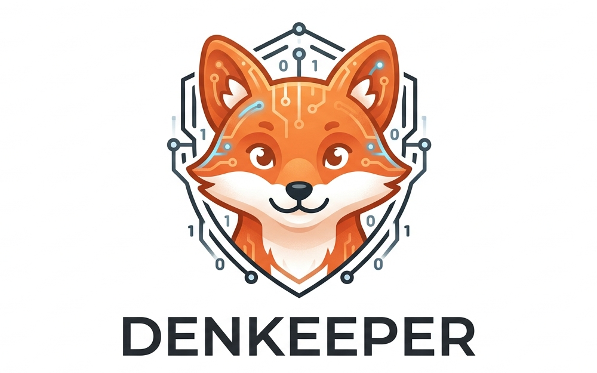

<p align="center">
  
</p>

<p align="center">
  <a href="https://github.com/Temikus/denkeeper/actions/workflows/ci.yml"></a>
  <a href="https://github.com/Temikus/denkeeper/actions/workflows/security.yml"></a>
  <a href="https://github.com/Temikus/denkeeper/releases/latest"></a>
  <a href="https://github.com/Temikus/denkeeper/pkgs/container/denkeeper"></a>
  <a href="https://goreportcard.com/report/github.com/Temikus/denkeeper"></a>
  <a href="LICENSE"></a>
</p>

A security-first personal AI agent that lives in your chat. Built in Go as a single binary, designed to run anywhere from a Raspberry Pi to a cloud VM.

Denkeeper connects to your Telegram or Discord, routes messages through LLM providers via [Anthropic](https://anthropic.com), [OpenAI](https://openai.com), [OpenRouter](https://openrouter.ai), or a local [Ollama](https://ollama.com) instance, and remembers conversations across sessions using a local SQLite database. It enforces per-session cost budgets, user allowlists, and a tiered permission system — so you stay in control of what it can do and how much it can spend.

## Installation

### One-liner (Linux and macOS)

```sh
curl -fsSL https://raw.githubusercontent.com/Temikus/denkeeper/main/install.sh | sh
```

To install to a custom prefix (e.g. without sudo):

```sh
curl -fsSL https://raw.githubusercontent.com/Temikus/denkeeper/main/install.sh | sh -s -- --prefix ~/.local
```

The installer detects OS/arch, downloads the correct release archive, verifies the SHA-256 checksum, and places the binary in `<prefix>/bin`.

### Debian / Ubuntu (.deb)

```sh
VERSION=$(curl -fsSL https://api.github.com/repos/Temikus/denkeeper/releases/latest | grep '"tag_name"' | sed 's/.*"\(v[^"]*\)".*/\1/')
curl -fsSL "https://github.com/Temikus/denkeeper/releases/download/${VERSION}/denkeeper_${VERSION#v}_linux_amd64.deb" -o denkeeper.deb
sudo dpkg -i denkeeper.deb
```

Configure and start the service:

```sh
sudo cp /etc/denkeeper/denkeeper.toml.example /etc/denkeeper/denkeeper.toml
sudoedit /etc/denkeeper/denkeeper.toml
sudo systemctl enable --now denkeeper
journalctl -u denkeeper -f
```

### RHEL / Fedora (.rpm)

```sh
VERSION=$(curl -fsSL https://api.github.com/repos/Temikus/denkeeper/releases/latest | grep '"tag_name"' | sed 's/.*"\(v[^"]*\)".*/\1/')
curl -fsSL "https://github.com/Temikus/denkeeper/releases/download/${VERSION}/denkeeper_${VERSION#v}_linux_amd64.rpm" -o denkeeper.rpm
sudo rpm -i denkeeper.rpm
```

### Docker

```sh
docker pull ghcr.io/temikus/denkeeper:latest
docker run -d --name denkeeper \
  -v ~/.denkeeper:/data \
  ghcr.io/temikus/denkeeper:latest
```

The container reads config from `DENKEEPER_CONFIG` (default `/data/denkeeper.toml`). Override with `-e DENKEEPER_CONFIG=/path/to/config.toml`.

### Helm (Kubernetes)

A Helm chart is available in [`deploy/helm/denkeeper/`](deploy/helm/denkeeper/) with support for Ingress, PVC persistence, secrets management, and security-hardened pod defaults:

```sh
helm install denkeeper deploy/helm/denkeeper/ \
  --set secrets.llmAnthropicApiKey=sk-ant-... \
  --set secrets.telegramToken=123456:ABC...
```

### Homebrew (macOS)

```sh
brew install Temikus/denkeeper/denkeeper
```

### Verify release signatures

All release archives are signed with [cosign](https://github.com/sigstore/cosign) (keyless OIDC — no long-lived keys):

```sh
cosign verify-blob \
  --signature checksums.txt.sig \
  --certificate checksums.txt.pem \
  --certificate-oidc-issuer=https://token.actions.githubusercontent.com \
  --certificate-identity-regexp='https://github.com/Temikus/denkeeper/.github/workflows/release.yml.*' \
  checksums.txt
```

Docker images are signed and carry SLSA build provenance attestations:

```sh
cosign verify \
  --certificate-oidc-issuer=https://token.actions.githubusercontent.com \
  --certificate-identity-regexp='https://github.com/Temikus/denkeeper/.github/workflows/release.yml.*' \
  ghcr.io/temikus/denkeeper:latest
```

## Features

- **Single binary** — no runtime dependencies, no containers required
- **Multi-agent routing** — run multiple named agents, each with their own persona, skills, LLM model, and permission tier
- **Telegram + Discord** — chat with your agent from your phone or Discord server, including inline Approve/Deny buttons for supervised actions; both adapters can run simultaneously
- **User allowlist** — only approved user IDs can interact (per-adapter)
- **LLM routing** — pluggable provider interface; Anthropic (direct), OpenAI (direct + Azure/vLLM-compatible), OpenRouter (cloud, hundreds of models), and Ollama (local inference) built-in
- **Fallback strategies** — automatic model/provider switching on errors, rate limits, or low funds
- **Cost tracking** — per-session budgets with automatic cutoff
- **Conversation memory** — SQLite-backed, persistent across restarts
- **Scheduler** — cron expressions, named intervals, and `@daily`/`@hourly` shorthand; per-schedule agent targeting and session modes
- **Skills** — flat markdown files with TOML frontmatter; trigger-based filtering (`command:`/`schedule:`) and per-agent skill merging
- **MCP tools** — spawn MCP servers via stdio (subprocess) or SSE/Streamable HTTP (remote), discover tools, and execute tool calls in an agentic loop; auto-restart on crash with configurable backoff; OAuth 2.1 authorization for remote MCP servers
- **MCP security** — SSRF protection (blocks localhost, link-local, and cloud metadata endpoints), HTTP header injection prevention, redirect target validation, env var denylist for secrets, and URL/arg redaction in API responses
- **Plugin system** — subprocess and Docker-sandboxed plugins with capability declarations and Ed25519 signature verification; tools capability wires plugin tools into the agent's LLM loop
- **Runtime tool management** — add and remove MCP tools and plugins at runtime without restarting; changes are persisted to TOML config
- **Agent KV store** — per-agent key-value storage with optional TTL, exposed as MCP tools (`kv_get`/`kv_set`/`kv_delete`/`kv_list`/`kv_set_nx`); useful for locks, counters, caches, and cross-session state
- **Web dashboard** — embedded Svelte UI (served via the API server) with overview, chat, sessions, approvals, schedules, skills, tools, agent context viewer, and API key management; includes dark mode toggle and warm light theme
- **Voice** — speech-to-text and text-to-speech via OpenAI (Whisper + TTS)
- **Permission tiers** — autonomous, supervised (default), and restricted; configurable per-agent or per-schedule
- **Approval workflows** — supervised-tier actions (profile updates, skill creation, schedule additions, tool installation) require explicit human approval via chat buttons (Telegram/Discord) or REST API
- **Config MCP server** — per-agent in-process MCP tools let the LLM manage skills, schedules, tools, plugins, KV storage, and inspect its own permission tier at runtime
- **External REST API** — HTTP server with scoped API key auth, rate limiting, CORS, and TLS support; chat endpoint with SSE streaming and WebSocket transport, session management, approval CRUD, tool/plugin CRUD, and API key management
- **Dashboard authentication** — password login (bcrypt), OAuth2/OIDC SSO (PKCE), session cookies (AES-256-GCM)
- **OpenTelemetry observability** — Prometheus `/metrics` endpoint and optional OTLP trace export
- **CLI plugin signing** — `denkeeper plugin keygen/sign/verify` commands for Ed25519 plugin binary signing and verification
- **CLI password hashing** — `denkeeper passwd` generates a bcrypt hash for dashboard password login
- **Personality** — ships with a [`SOUL.md`](agents/default/SOUL.md) that gives the agent character (editable)

## Architecture

```
Adapter (Telegram/Discord) ─┐
Web Dashboard (WS/SSE) ─────┼→ Dispatcher → Engine (per agent) → LLM Router → Provider (Anthropic/OpenAI/OpenRouter/Ollama)
REST API (/api/v1/chat) ────┘                    ↕                    ↕
                                             MemoryStore          CostTracker
                                             (SQLite)

Scheduler ──────────────────────────────────────┘
```

The Dispatcher routes incoming messages to named agent Engines based on adapter bindings. Each Engine checks permissions, loads conversation history, builds the system prompt (persona + skills), calls the LLM (with tool-call loop if MCP tools are configured), stores the response, and sends it back through the adapter.

## Quick start

### Prerequisites

- Go 1.25+ (managed via [mise](https://mise.jdx.dev) — see `mise.toml`)
- A Telegram bot token (from [@BotFather](https://t.me/BotFather))
- An API key for your chosen LLM provider: [OpenRouter](https://openrouter.ai/keys), [Anthropic](https://console.anthropic.com/settings/keys), or a local [Ollama](https://ollama.com) instance
- Your Telegram user ID (from [@userinfobot](https://t.me/userinfobot))

### Setup

```bash
# Clone
git clone https://github.com/Temikus/denkeeper.git
cd denkeeper

# Copy and edit the config
mkdir -p ~/.denkeeper
cp denkeeper.toml.example ~/.denkeeper/denkeeper.toml
# Fill in your token, API key, and user ID
$EDITOR ~/.denkeeper/denkeeper.toml

# Build and run
just build
./pkg/bin/denkeeper serve
```

Or run directly without building:

```bash
just serve
```

### Configuration

Denkeeper uses a single TOML file (default `~/.denkeeper/denkeeper.toml`). See [`denkeeper.toml.example`](denkeeper.toml.example) for all options. The config path can be set via `--config` flag or `DENKEEPER_CONFIG` env var.

**Health check**: `GET /api/v1/health` returns `{"status":"ok"}` with no authentication required. Use this for Docker `HEALTHCHECK` or Kubernetes liveness/readiness probes (requires `api.enabled = true`).

Key sections:

| Section | Purpose |
|---------|---------|
| `[telegram]` | Bot token and allowed user IDs |
| `[discord]` | Bot token and allowed user snowflake IDs |
| `[llm]` | Default provider (`anthropic`/`openrouter`/`ollama`), model, and per-session cost cap |
| `[llm.anthropic]` | Anthropic API key (direct provider; no OpenRouter key needed) |
| `[llm.openrouter]` | OpenRouter API key |
| `[llm.ollama]` | Ollama base URL (default: `http://localhost:11434`) |
| `[[llm.fallback]]` | Fallback strategies (error/rate_limit/low_funds triggers) |
| `[session]` | Default permission tier (supervised/autonomous/restricted) |
| `[[agents]]` | Multi-agent definitions (persona, skills, LLM model, adapter bindings) |
| `[mcp]` | Global MCP settings — request timeout, auto-restart, max restart attempts, restart cooldown, SSE URL allowlist |
| `[tools.*]` | MCP tool server definitions — stdio (subprocess) or SSE (remote) transport, URL, headers, per-server timeout override |
| `[plugins.*]` | Plugin definitions — subprocess or Docker-sandboxed (capability declarations) |
| `[security]` | Ed25519 plugin signing config (`trusted_keys`, `allow_unsigned`) |
| `[voice]` | STT/TTS configuration (OpenAI) |
| `[api]` | External REST API (listen addr, TLS, CORS, rate limiting, API keys with scopes) |
| `[api.auth]` | Dashboard authentication (bcrypt password, session secret, OIDC SSO) |
| `[otel]` | OpenTelemetry observability (Prometheus metrics, OTLP trace export) |
| `[[schedules]]` | Recurring tasks (cron, interval, or named schedules) |
| `[kv]` | Agent KV store limits (`max_keys_per_agent`, `max_value_bytes`, `cleanup_interval`) |
| `[memory]` | SQLite database path |
| `[log]` | Log level and format |

### Environment Variables

Secrets and select config fields can be set via environment variables, which take precedence over values in `denkeeper.toml`. This enables the standard Kubernetes pattern of using a ConfigMap for config and a Secret for credentials.

| Env Var | Config Field |
|---------|-------------|
| `DENKEEPER_CONFIG` | Config file path (replaces `--config` flag) |
| `DENKEEPER_TELEGRAM_TOKEN` | `telegram.token` |
| `DENKEEPER_DISCORD_TOKEN` | `discord.token` |
| `DENKEEPER_LLM_PROVIDER` | `llm.default_provider` |
| `DENKEEPER_LLM_MODEL` | `llm.default_model` |
| `DENKEEPER_LLM_OPENROUTER_API_KEY` | `llm.openrouter.api_key` |
| `DENKEEPER_LLM_ANTHROPIC_API_KEY` | `llm.anthropic.api_key` |
| `DENKEEPER_LLM_ANTHROPIC_BASE_URL` | `llm.anthropic.base_url` |
| `DENKEEPER_LLM_OLLAMA_BASE_URL` | `llm.ollama.base_url` |
| `DENKEEPER_LLM_OPENAI_API_KEY` | `llm.openai.api_key` |
| `DENKEEPER_LLM_OPENAI_BASE_URL` | `llm.openai.base_url` |
| `DENKEEPER_VOICE_OPENAI_API_KEY` | `voice.openai.api_key` |
| `DENKEEPER_LOG_LEVEL` | `log.level` |
| `DENKEEPER_LOG_FORMAT` | `log.format` |
| `DENKEEPER_MEMORY_DB_PATH` | `memory.db_path` |
| `DENKEEPER_API_ENABLED` | `api.enabled` (accepts `"true"` or `"1"`) |
| `DENKEEPER_API_LISTEN` | `api.listen` |
| `DENKEEPER_SESSION_TIER` | `session.tier` |
| `DENKEEPER_API_AUTH_SESSION_SECRET` | `api.auth.session_secret` (AES-256 hex key) |
| `DENKEEPER_OIDC_CLIENT_ID` | `api.auth.oidc.client_id` |
| `DENKEEPER_OIDC_CLIENT_SECRET` | `api.auth.oidc.client_secret` |
| `DENKEEPER_API_WEBSOCKET_ENABLED` | `api.websocket_enabled` (accepts `"true"` or `"false"`) |
| `DENKEEPER_OTEL_TRACES_ENDPOINT` | `otel.traces_endpoint` (OTLP HTTP endpoint) |

A Helm chart is available in [`deploy/helm/denkeeper/`](deploy/helm/denkeeper/) for Kubernetes deployments.

### Skills

Skills are markdown files that teach the agent how to handle specific tasks. They use TOML frontmatter enclosed in `+++` delimiters:

```markdown
+++
name = "daily-briefing"
description = "Compile and deliver a daily briefing"
version = "1.0.0"
triggers = ["schedule:daily:08:00", "command:briefing"]
+++

# Daily Briefing

When triggered, compile a briefing with:
1. Weather forecast for the user's location
2. Top 3 news headlines
3. Any pending reminders
```

Place skill files in `~/.denkeeper/skills/` (configurable via `[agent] skills_dir`). Subdirectories with a `SKILL.md` file are also supported. Skills with `triggers` are only injected when matched; skills without triggers are always included.

Agent-specific skills in `<persona_dir>/skills/` override global skills of the same name.

A sample `help` skill is included in `agents/default/skills/`.

### Multi-Agent

Define multiple agents, each with their own persona, skills, LLM model, and adapter bindings:

```toml
[[agents]]
name = "default"
persona_dir = "~/.denkeeper/agents/default"
adapters = ["telegram"]              # wildcard: all Telegram messages

[[agents]]
name = "work-assistant"
persona_dir = "~/.denkeeper/agents/work-assistant"
adapters = ["telegram:987654321"]    # specific chat only
llm_model = "openai/gpt-4o"
session_tier = "restricted"
```

If no `[[agents]]` section is present, a single `"default"` agent is synthesized from `[agent]`/`[session]`.

### Schedules

Schedules support three expression formats, per-schedule agent targeting, and configurable session modes:

```toml
[[schedules]]
name = "daily-briefing"
type = "agent"
schedule = "0 8 * * *"
skill = "daily-briefing"
agent = "default"                # target agent (default: "default")
session_tier = "supervised"
session_mode = "isolated"        # fresh context each run (default: "shared")
channel = "telegram:YOUR_CHAT_ID"
enabled = true

[[schedules]]
name = "hourly-check"
type = "agent"
schedule = "@every 1h"           # or @daily, @hourly, @weekly
channel = "telegram:YOUR_CHAT_ID"
```

`session_mode = "isolated"` creates a fresh conversation context for each run so scheduled jobs don't mix into your regular chat history.

### REST API

The API server and web dashboard are enabled by default (listening on `:8080`). All endpoints (except `/health`) require a `Bearer` token matching a configured API key.

```toml
[api]
listen = "0.0.0.0:8080"

[[api.keys]]
name = "my-client"
key  = "dk-your-secret-key"
scopes = ["chat", "sessions:read", "costs:read"]
```

**Available scopes**: `chat`, `admin`, `agents:read`, `agents:write`, `sessions:read`, `costs:read`, `skills:read`, `skills:write`, `schedules:read`, `schedules:write`, `approvals:read`, `approvals:write`, `tools:read`, `tools:write`, `kv:read`, `kv:write`

**Endpoints:**

| Method | Path | Scope | Description |
|--------|------|-------|-------------|
| `GET` | `/api/v1/health` | — | Health check (no auth) |
| `GET` | `/api/v1/setup` | — | First-run setup status |
| `POST` | `/api/v1/setup` | — | Initialize first-run configuration |
| `POST` | `/api/v1/chat` | `chat` | Send a message; returns `{ session_id, response }`. Add `Accept: text/event-stream` for SSE. |
| `GET` | `/api/v1/ws` | `chat` | WebSocket upgrade for bidirectional streaming (auth via `?token=` or session cookie) |
| `GET` | `/api/v1/models` | `agents:read` | List available LLM models from all providers |
| `GET` | `/api/v1/sessions` | `sessions:read` | List all conversations |
| `GET` | `/api/v1/sessions/{id}/messages` | `sessions:read` | Get messages for a session |
| `DELETE` | `/api/v1/sessions/{id}` | `sessions:read` | Delete a session and its history |
| `GET` | `/api/v1/agents` | `agents:read` | List agents with metadata |
| `GET` | `/api/v1/agents/{name}` | `agents:read` | Agent details and skills |
| `PATCH` | `/api/v1/agents/{name}` | `agents:write` | Mutate agent config |
| `GET` | `/api/v1/skills` | `skills:read` | List all skills across agents |
| `GET` | `/api/v1/skills/{agent}` | `skills:read` | List skills for a specific agent |
| `POST` | `/api/v1/skills/{agent}` | `skills:write` | Create a skill |
| `PUT` | `/api/v1/skills/{agent}/{name}` | `skills:write` | Update a skill |
| `DELETE` | `/api/v1/skills/{agent}/{name}` | `skills:write` | Delete a skill |
| `GET` | `/api/v1/schedules` | `schedules:read` | List schedules with run times |
| `POST` | `/api/v1/schedules` | `schedules:write` | Create a schedule |
| `PATCH` | `/api/v1/schedules/{name}` | `schedules:write` | Update a schedule |
| `DELETE` | `/api/v1/schedules/{name}` | `schedules:write` | Delete a schedule |
| `GET` | `/api/v1/costs` | `costs:read` | Cost summary |
| `GET` | `/api/v1/approvals` | `approvals:read` | List approval requests (filter by `?status=pending`) |
| `GET` | `/api/v1/approvals/{id}` | `approvals:read` | Get a single approval request |
| `POST` | `/api/v1/approvals/{id}/approve` | `approvals:write` | Approve; `?auto_approve=session\|permanent` to create auto-approve rule |
| `POST` | `/api/v1/approvals/{id}/deny` | `approvals:write` | Deny a pending request |
| `GET` | `/api/v1/auto-approve` | `approvals:read` | List auto-approve rules (filter by `?agent=`) |
| `POST` | `/api/v1/auto-approve` | `approvals:write` | Create an auto-approve rule |
| `DELETE` | `/api/v1/auto-approve/{id}` | `approvals:write` | Delete an auto-approve rule |
| `GET` | `/api/v1/keys` | `admin` | List API keys (secrets not returned) |
| `POST` | `/api/v1/keys` | `admin` | Create a new API key |
| `DELETE` | `/api/v1/keys/{id}` | `admin` | Revoke an API key |
| `DELETE` | `/api/v1/keys/{id}/permanent` | `admin` | Permanently delete a revoked key |
| `POST` | `/api/v1/keys/{id}/rotate` | `admin` | Rotate an API key |
| `GET` | `/api/v1/tools` | `tools:read` | List MCP tool servers |
| `GET` | `/api/v1/tools/{name}` | `tools:read` | Get tool server details |
| `POST` | `/api/v1/tools` | `tools:write` | Add a tool server |
| `PUT` | `/api/v1/tools/{name}` | `tools:write` | Edit a tool server |
| `DELETE` | `/api/v1/tools/{name}` | `tools:write` | Remove a tool server |
| `GET` | `/api/v1/tools/{name}/health` | `tools:read` | Tool server health status |
| `POST` | `/api/v1/tools/{name}/restart` | `tools:write` | Manually restart a tool server |
| `GET` | `/api/v1/plugins` | `tools:read` | List plugins |
| `GET` | `/api/v1/plugins/{name}` | `tools:read` | Get plugin details |
| `POST` | `/api/v1/plugins` | `tools:write` | Add a plugin |
| `DELETE` | `/api/v1/plugins/{name}` | `tools:write` | Remove a plugin |
| `GET` | `/api/v1/kv/{agent}` | `kv:read` | List KV keys for an agent |
| `DELETE` | `/api/v1/kv/{agent}/{key}` | `kv:write` | Delete a KV key |

**Chat example:**

```bash
# Non-streaming
curl -X POST http://localhost:8080/api/v1/chat \
  -H "Authorization: Bearer dk-your-secret-key" \
  -H "Content-Type: application/json" \
  -d '{"message": "Hello!", "session_id": "my-session"}'

# SSE streaming
curl -X POST http://localhost:8080/api/v1/chat \
  -H "Authorization: Bearer dk-your-secret-key" \
  -H "Content-Type: application/json" \
  -H "Accept: text/event-stream" \
  -d '{"message": "Hello!", "session_id": "my-session"}'
```

Pass the same `session_id` in subsequent requests to continue the conversation. Omit it to start a new session with an auto-generated ID.

## Development

[just](https://github.com/casey/just) is used as the command runner. Run `just` to see all available recipes:

```
just build           # Build the denkeeper binary (requires web/dist/ to exist)
just build-ui        # Build the Svelte web dashboard (requires Node.js)
just build-full      # Build web dashboard then Go binary in one step
just serve           # Start the agent (just serve ./path/to/config.toml)
just web-dev         # Start Vite dev server for dashboard hot-reload
just test            # Run all tests with race detector
just test-v          # Verbose test output
just test-pkg <pkg>  # Test a single package (e.g. just test-pkg internal/agent)
just test-cover      # Tests with coverage report
just test-cover-html # Open coverage in browser
just lint            # Run golangci-lint
just lint-fix        # Lint with auto-fix
just fmt             # Format all Go files
just fmt-check       # CI-friendly format check
just vet             # Run go vet
just check           # Run all checks (fmt + vet + lint + test)
just tidy            # go mod tidy
just clean           # Remove build artifacts
just loc             # Count lines of source vs test code
```

### Project structure

```
cmd/denkeeper/       Entry point
internal/
  adapter/           Platform integrations
    telegram/        Telegram bot adapter
    discord/         Discord bot adapter
  agent/             Dispatcher, engine, and conversation memory
  api/               External REST API server
  approval/          Approval workflow manager, store, registry, and callback handler
  config/            TOML config parsing and validation
  configmcp/         Per-agent Config MCP server (skill/schedule/tier/tool/KV tools)
  kv/                Per-agent key-value store with TTL
  llm/               Provider interface, router, cost tracking
    anthropic/       Anthropic direct client
    openai/          OpenAI direct client (Azure/vLLM-compatible)
    openrouter/      OpenRouter client
    ollama/          Ollama local inference client
  persona/           Persona file loader (SOUL.md, USER.md, MEMORY.md)
  plugin/            Plugin manager (subprocess and Docker-sandboxed)
  sandbox/           Pluggable sandbox runtime (Docker and Kubernetes backends)
  scheduler/         Cron and interval scheduling
  security/          Permission engine (tiers) and Ed25519 plugin signing
  skill/             Skill file loader, trigger matching, merging
  tool/              MCP tool server manager
    oauth/           MCP OAuth 2.1 authorization for remote tool servers
  voice/             STT/TTS provider interface
    openai/          OpenAI Whisper + TTS client
  web/               Embedded web dashboard handler (serves web/dist/)
web/                 Svelte dashboard source (npm build → web/dist/)
pkg/bin/             Build output (gitignored)
agents/default/
  skills/            Bundled skills (e.g. help.md)
  SOUL.md            Agent personality
```

## Roadmap

Denkeeper is built in phases:

**Phase 1 — Foundation** ✅
- [x] Telegram adapter with user allowlist
- [x] LLM routing via OpenRouter
- [x] Conversation memory (SQLite)
- [x] Per-session cost budgets
- [x] Permission engine (supervised tier)
- [x] Agent persona system (SOUL.md, USER.md, MEMORY.md injection)

**Phase 2 — Core Features** ✅
- [x] Multi-agent routing with per-agent personas, skills, LLM models, and permissions
- [x] Scheduler with cron/interval/named expressions, per-schedule agent targeting
- [x] Configurable session modes for schedules (`shared`/`isolated`)
- [x] Skills system with trigger-based filtering and per-agent merge
- [x] MCP tool support (agentic tool-call loop)
- [x] Fallback strategies (error/rate_limit/low_funds → switch_provider/switch_model/wait_and_retry)
- [x] Voice messages (STT/TTS via OpenAI)
- [x] Three permission tiers (autonomous/supervised/restricted), per-agent and per-schedule
- [x] External REST API server skeleton (auth, rate limiting, CORS, TLS, health endpoint)

**Phase 3 — Extensibility** ✅
- [x] REST API chat endpoint — `POST /api/v1/chat` with JSON response and SSE streaming, `session_id` for conversation continuity, `DELETE /api/v1/sessions/:id`
- [x] Approval workflows — supervised-tier Telegram inline buttons (Approve/Deny) + REST API (`GET|POST /api/v1/approvals/...`); TTL expiry, stale callback UX, keyboard auto-removal on resolution
- [x] Config MCP server — per-agent in-process MCP tools for skill, schedule, tool, plugin, and KV self-modification
- [x] Ollama LLM provider — local inference with conditional OpenRouter API key validation
- [x] Plugin system — subprocess and Docker-sandboxed plugins with capability declarations and Ed25519 signature verification
- [x] Runtime tool management — add/remove MCP tools and plugins at runtime; REST API CRUD (`tools:read`/`tools:write` scopes); TOML config persistence
- [x] Agent KV store — per-agent SQLite-backed key-value storage with TTL, exposed as Config MCP tools
- [x] CLI plugin signing — `denkeeper plugin keygen/sign/verify` commands for Ed25519 binary signing
- [x] Web dashboard — embedded Svelte UI with overview, chat, sessions, approvals, schedules, skills, tools, agents, and API key management

**Phase 4 — Polish** ✅
- [x] Discord adapter — DM and guild channel support, allowlist, typing indicator, action-row approval buttons
- [x] Anthropic direct LLM provider — Anthropic Messages API, tool_use support, no OpenRouter dependency
- [x] API Key CRUD — runtime key management (create/revoke/rotate) without TOML restarts
- [x] Web dashboard Chat page — SSE streaming chat UI in the dashboard
- [x] GoReleaser, .deb/.rpm packages, Homebrew tap config
- [x] CI/CD pipeline (golangci-lint, govulncheck, cosign signing, SBOM generation)
- [x] One-liner install script + systemd service unit

**Phase 5 — Documentation** ✅
- [x] Hugo documentation website (Hugo + Doks theme, deployed via GitHub Pages at [denkeeper.io](https://denkeeper.io))
- [x] Getting-started guides, concept docs, and reference pages
- [x] One-liner install script hosted at `get.denkeeper.io`

**Phase 6 — Browser Automation** ✅
- [x] Browser automation — first-party Docker plugin with headless Chromium + Playwright MCP server, tmpfs/shm support for read-only containers
- [x] Persistent browser profiles — per-agent profile storage with volume mounts
- [x] URL allowlist enforcement — per-agent domain filtering with wildcard support, link-local/metadata blocking
- [x] Browser orchestrator skill — built-in skill for multi-step browser workflow patterns (vision + non-vision LLMs)
- [x] Screenshot-to-text fallback — DOM extraction pipeline with readability heuristics for non-vision LLMs

**Phase 7 — Remote MCP & Observability** ✅
- [x] Remote MCP servers — SSE/Streamable HTTP transport alongside existing stdio; auto-restart with configurable backoff (`[mcp]` section)
- [x] MCP security hardening — SSRF blocklist, HTTP header injection prevention, redirect target validation, env var denylist for secrets, URL/arg redaction in API responses
- [x] Pipeline logging — structured log events throughout the chat pipeline with finish reason, token breakdown, tool durations, and round summaries
- [x] Real-time tool call streaming — `tool_start`/`tool_end` SSE events with `duration_ms` for inline tool progress in the web dashboard

**Phase 8 — Cost Accuracy** ✅
- [x] Pricing registry — bundled defaults for ~70 models with exact-match > prefix-match > fallback lookup
- [x] Pricing source tracking — `pricing_source` OTel attribute for cost auditability

**Phase 9 — WebSocket Streaming** ✅
- [x] WebSocket transport — bidirectional `GET /api/v1/ws` with auto-reconnect, replay buffer, and SSE fallback
- [x] Inline approvals — approve/deny/auto-approve tool calls directly in the web chat UI
- [x] Auto-approve rules — session-scoped (in-memory) and permanent (SQLite) rules with REST API CRUD
- [x] MCP OAuth 2.1 — authorization flow for remote SSE tool servers (e.g. Todoist); per-tool `auth = "oauth"` config

**Phase 10 — Web UI Testing & Polish** ✅
- [x] Web UI test infrastructure — Vitest + jsdom + MSW with 130+ tests
- [x] Web UI redesigns — card-layout Tools page with inspector modal, grouped sidebar navigation, animated theme toggle
- [x] Session selector in chat toolbar
- [x] Helm chart enhancements — `extraContainers` and ServiceMonitor support

## License

[Apache 2.0](LICENSE)
